  

  <h3>Frontend Engineer · React / Next.js 前端工程師 ‧ 專注現代化架構與高維護性網頁開發</h3>

  

    
    &nbsp;
    
  

### About

我是 **Ben**，2 年以上實務經驗的前端工程師，專注 **React / Next.js (App Router)**，並具備 Node.js 與 Laravel 後台整合能力。重視架構清晰、MVP 快速驗證與效能最佳化。

> Frontend Engineer (2+ yrs) focused on React & Next.js App Router, with full-stack integration via Node.js and Laravel. Clean architecture, pragmatic MVPs, fast web.

### Tech Stack

### Now

- **Next.js App Router** 架構實踐 · 企業後台系統（Laravel / Vite / Pure JS）
- 深入 **Next.js 16、TypeScript** 與前端效能最佳化
- 架構清晰優先、**MVP 快速驗證**，避免過早過度工程化
- 歡迎交流 **React / Next.js 生態、Tailwind CSS、後台模組化整合**

### GitHub Stats

SVGs regenerated daily by <a href="./.github/workflows/update.yml">GitHub Actions</a> · zero dependencies
